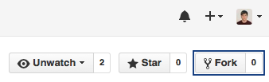
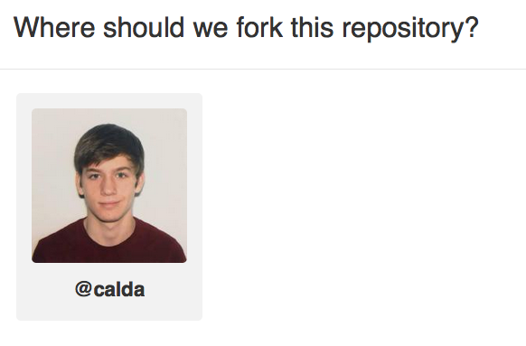

## Part 1: Creating your Xcode Project

This tutorial will teach you how to build a Calculator app using Interface Builder and Storyboards. To get started, open up Xcode. You should see a screen that looks like this: 

  

Click **Create a new Xcode Project** and select the iOS Single View Application template. 
(If you don't see the welcome screen, `Command-Shift-N` will get the job done.)

  

Fill out information about your project. You don't need a Team, but can select one if you it. Your organization name and identifier can be anything you want.

  

Xcode will create your new project and pop it open. You should have these files:

  

- **AppDelegate.swift**: Communication point between iOS and your app.
- **ViewController.swift**: A View Controller is a single screen on an iPhone app. It controls the content on-screen and handles user interaction.
- **Main.storyboard**: Contains the layout of your app. We'll open this in a sec.
- **Assets.xcassets**: Contains images that yor app uses, including the icon.
- **LaunchScreen.storyboard**: A static storyboard that opens while your app is launching.
- **Info.plist**: Configures some properties of your app.

### Recap

You set up your Xcode project and you're ready to get started with the real meat of the tutorial.

### Next Time

We will crack open Interface Builder and learn the foundations of designing a user interface.

#### [Part 2: Getting the hang of Interface Builder](../P2/part2.md)
