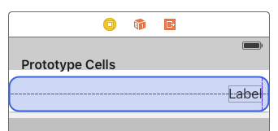
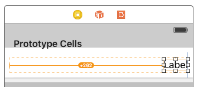
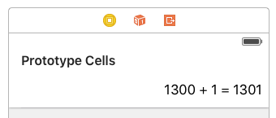
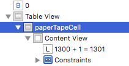

## Part 10: Implementing your Custom TableViewCell

We have our `UITableView` in place, but it still needs rows, or cells.

### Prototype Cells 

In Interface Builder, the cells we make are called *Prototype Cells*. They represent templates that will be used at runtime. If you have 10 rows, then UIKit creates 10 instances of the prototype cell and customizes them accordingly.

We only need one Prototype Cell, because all of our content will be the same. To add one, click on the Table View and then take a look at the Attributes Inspector.

<p align="center">  </p>

Increase the number of Prototype Cells from 0 to 1. Now you should have an empty white cell in the Table View.

<p align="center">  </p>

Every Table View Cell **must have** a unique *Reuse Identifier*. The Reuse Identifier tells UIKit the name of the prototype cell so it knows which template to use. You set the Reuse Identifier by clicking on the Table View Cell and visiting the Attributes Inspector again. I set the identifier to `paperTapeCell` but you can use anything.

<p align="center">  </p>

### Designing the Paper Tape Cell

Now we have to set up the content of the Paper Tape Cell prototype. This is just going to be one UILabel, aligned to the right side of the cell. Again, super simple to do with constraints.

Drag a `UILabel` into the Collection View cell, again making sure to align it with the guides.

<p align="center">  </p>

Now, it's back to the Tie Fighter menu. This time, you want to leave `Constrain to margins` checked on, because it would be strange for a label to go all the way to the edge of the screen. After that, it's zeros all around.

<p align="center">  </p>

You'll be left with the orange lines again, so *Update Frames* comes to the rescue again. Click on the label and then press the **⌘⌥=** (Command-Option-Equals) keys on your keyboard. (Get used to that one because you'll use it all the time.)

<p align="center">  </p>

<p align="center">  </p>

Now we have the label on the far left instead of the right. It makes sense based on our constraints, but isn't really what we want. Thankfully, this is another fix. **Alignment** options under the label's Attributes Inspector solves that problem for us.

<p align="center">  </p>

<p align="center">  </p>

Now we have a Prototype Cell with everything we need. We aren't done yet, though.

### Implementing the PaperTapeCell

We have a custom prototype cell, but that doesn't mean UIKit is capable of customizing it for us. We need to create a subclass of `UITableViewCell` that has the logic for updating the cell based on the input. If you don't know what that means, it's ok. If you ever followed out other tutorials with SpriteBuilder, then this process will be very similar to adding custom classes and behavior to the sprites there.

We need to revisit our `ViewController.swift`. We'll add a new class at the bottom of this file. (*Sidenote: Some languages like Java require all classes to be in their own file. Swift is not one of those languages. We can have 100 classes in one file if we're crazy enough. Not a good idea though.*)

```swift
//at the bottom of ViewController.swift
class PaperTapeCell : UITableViewCell {

}
```

With this, we're *extending* UITableViewCell, adding extra functionality. Specifically, this functionality will control the customization of our Prototype Cell.

#### Telling the prototype cell that it *is* a PaperTapeCell

The prototype cell has a *Reuse Identifier*, but that isn't enough for Xcode to automatically link our cell to this class. We have to tell Interface Builder that our prototype cell *is* a PaperTapeCell.

Switch back to the `Main.storyboard` and select the `paperTapeCell` (our Prototype Cell). Make doubly sure that you selected the cell itself and **not** the UILabel inside it.

<p align="center">  </p>

Then you'll need to use the Identity Inspector (the one with the ID card) for the Table Cell. This tab is where you can set the Custom Class of an object. Set the class to `PaperTapeCell`. Xcode should auto-fill after you type a few characters, meaning it recognizes the custom class as valid.

<p align="center">  </p>

Now we can use this custom class to customize the prototype.

#### Customizing the Prototype Cell

Before we can customize anything, we need to create an @IBOutlet to our UILabel sitting inside the cell. Like when we set up the @IBOutlets for the View Controller, you'll need to open up the `ViewController.swift` and the `Main.storyboard` side-by-side. Take a look at [Part 5: Connecting Storyboard to Code](../P5/part5.md) if you need a refreshed on how to do that.

Connect the UILabel to the `PaperTapeCell` class (using control-drag), and name it `label`.

```swift
class PaperTapeCell : UITableViewCell {
 
    @IBOutlet weak var label: UIView!
    
}
```

Now we have access to the label itself, and we can modify values like `label.text`. It's good practice to use a single function to control all of the cell's customization, so we can go ahead and write that:

```swift
class PaperTapeCell : UITableViewCell {
 
    @IBOutlet weak var label: UILabel!
    
    func customize(customString: String) {
        label.text = customString
    }
    
}
```

Now our custom cell is ready to be utilized by the UITableView.

### Recap
You designed an implemented your custom prototype UITableViewCell using many of the skills you developed in the first 6 parts of this tutorial.

### Next Time
We will implement code for the Table View, turning our `UIViewController` into a `UITableViewDataSource`.

#### [Part 11: Implementing your TableViewDataSource](../P11/part11.md)
