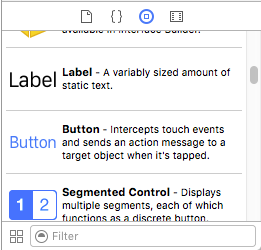
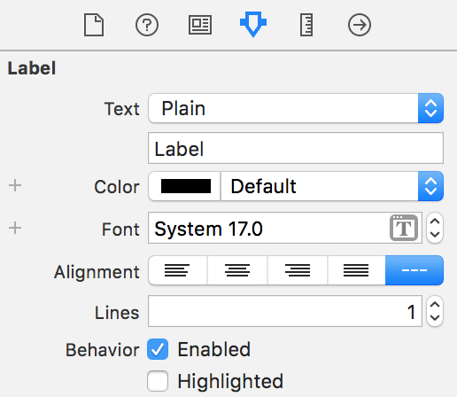

## Part 2: Getting the hang of Interface Builder

**Interface Builder** is Xcode's GUI editor. For most projects, the interface is contained in the `Main.storyboard` file. Open it up and have a look around.

  

You should see something that looks like this. There are three important parts worth knowing:

1. **Editor Canvas:** This is where you design your layouts. What you see here is what you will get when you run the app on your phone, to an extent.
2. **The Inspector:** This pane is where you modify anything and everything. It shows options for whatever you have selected.
3. **UI Palette:** Nestled at the bottom of the inspector, the UI Palette is where you find the components that you use to build your interfaces.
4. **Bottom bar:** This one has the most creative name. This bar controls the size of the device in the canvas and has other controls we'll use later on.

Now, remember we're making a calculator. When it comes down to it, there are two parts to the interface we're building.

1. Buttons. Lots of buttons. (Numbers and operators)
2. One big output display.

Interface Builder has our backs. Among the many tools at our disposal, we have the humble `UIButton` and `UILabel`. UIButtons are the standard button object in iOS, and UILabels are nothing more than simple text displays. Seems perfect for us. Scroll through the UI Palette until you find them (they're pretty close to the top).

  

You can drag components from the UI Palette into your View Controller. Go ahead and drag a `Label` over and drop it on somewhere on the view. The process should look something like this:

  

### And he said, "Let there be Label"
You can customize the label to your heart's content, too. Select the label and select the fourth tab in the Inspector. You should see a treasure-trove of customization options. Some are very clear..

  

Play around some. Try to customize the text and make the font size larger. Both of these options are in the first five rows, so they should be pretty easy to manage. You might have to make the label larger, but you can do that just as easily by dragging the bottom-right corner of the label in the canvas.

### Reality Check in the Simulator

Now's a good time to make sure we're on the right track. Lets run our app in the simulator and see what happens. We *should* see **exactly** what we see on the canvas (some sort of customized UILabel floating inside our View Controller).

At the top of the Xcode window, you have your `Project Targets`. This is where you run your app, either on a physical device or the iOS Simulator.

  

On the very right, you have the target device. Change it to whichever device is listed on the bottom bar of Interface Builder. Press play and the Simulator should pop open. It takes some time to boot up, but give it a moment.

  

If everything went according to plan, you should see your label. If you don't see it, try again. Delete the old label by clicking it and then pressing `backspace` on the keyboard. Then go through the same steps as before. If it helps you out, these are the attributes I used:

  

### Recap
Interface Builder is very visual. What you see if what you get, *to an extent*. You can add and modify components to the canvas and see them in the Simulator.

### Next Time
We will learn how to use Interface Builder to make layouts with multiple buttons and how to customize the look of components on screen.

#### [Part 3: Designing your layout with Interface Builder](../P3/part3.md)
