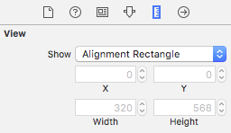
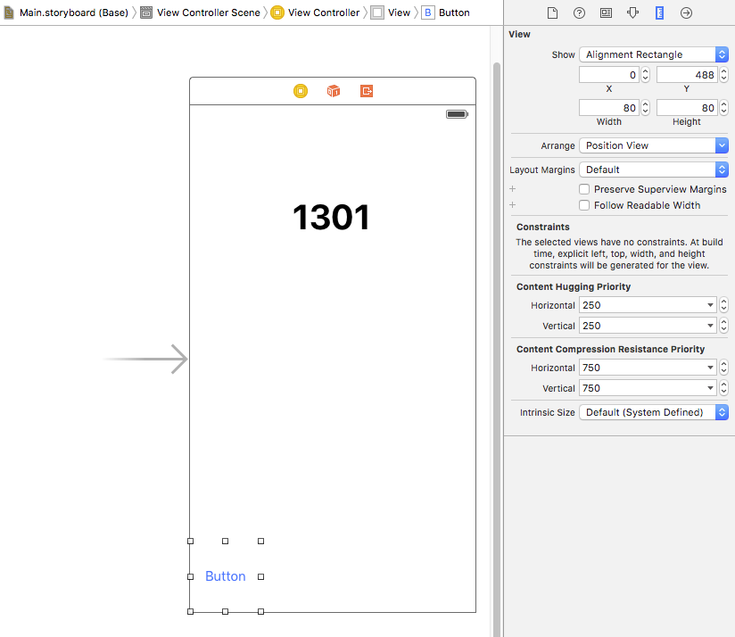
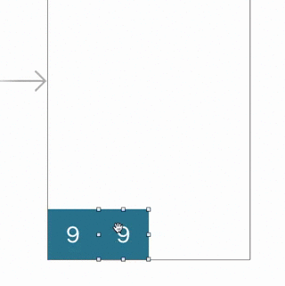
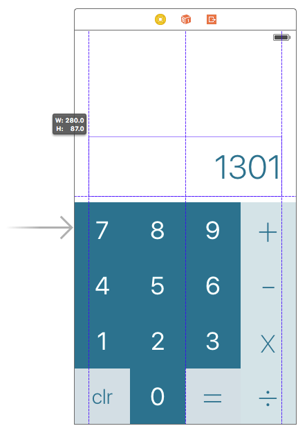

## Part 3: Designing your layout with Interface Builder

You understand the basics of working with Interface Builder, so you're ready to hit the ground running on an actual design. Let's revisit the checklist of what we need:

1. Buttons. Lots of buttons. (Numbers and operators)
2. One big output display.

In [Part 2](/P2/part2.md), we finished with a UILabel in the center of the screen somewhere. That satisfies "One big output display", so now we just need some buttons.

### Buttons. Lots of buttons.

We know we're gonna need lots of buttons, so let's get a tally running.

1. **Number buttons** (1, 2, 3, 4, 5, 6, 7, 8, 9, and 0)
2. **Operator buttons** (+, -, x, /)
3. An **equals button** to finalize the expression (=)
4. A **clear button** to reset user input

That's **16** buttons. I'm thinking a 4x4 grid of buttons. This is gonna be a piece of cake. (Atleast we didn't have 17 buttons to deal with...)

#### Back to Interface Builder

Just as we had `UILabel` for text, we have `UIButton` for buttons. Easy enough, yeah?

  

We have a lot of buttons to deal with, so let's make sure to do this methodically instead of just dropping them all over the place. Starting at the bottom left corner, drag one into place. Interface Builder has automatic guides to help you out in guiding the button in to place.

  

Now let's think this through some. We want a 4x4 grid of buttons, with each button a square. That means every button needs to be 1/4th the width of the View. We could try and eyeball it, but precision would definitely be more useful.

**We need to find out the width of the View itself**. If we click on the bar at the top, that shows the inspector for the *View Controller*. Close, but not quite the same thing. Let's take a look at the hierarchy on the left.

  

There's a View Controller, then a *View*, and then the components we dragged in from the UI Palette. Click on the **View**, and then information about it should populate the inspector on the right. Switch to the **Size Inspector** (the ruler).

  

In the Size Inspector, we can see important specs about a view's coordinate position and its width and height. For the main view, these values can't be changed, but we can see them. **The view is 320 points wide**.

#### Important Side note about Points vs Pixels

In iOS development everything is expressed in Point values instead of Pixel values. iOS devices have scale values of either @1x, @2x, or @3x:

- **@1x**: A device without Retina Display. Every interface "point" is one on-screen pixel.
- **@2x**: A device with standard Retina Display. Every interface "point" is four on-screen pixels (a 2x2 area).
- **@3x**: A device with an even higher resolution Retina Display (The iPhone 6/6S Plus). Every interface "point" is nine on-screen pixels (a 3x3 area).

Points allow code to make sense and work the same regardless of the pixel-density of a device. Otherwise everything would be a huge headache.

#### Back to Interface Builder again
If the main view is 320 points wide, then that means each button needs 80 points wide and 80 points tall. Click on the `Button` in the view hierarchy and then open the Size Inspector again. This time, you should be able to modify the width and height values. Change them both to 80, and then reposition the button as necessary.

  

Now you should have a button that is exactly 1/4th the width of the main view. This will tile exceptionally well, which is great for us and our 15 other buttons.

### Customizing the button
Before we flex our copy/paste muscles on that lonely button, let's customize it to look more like what we want. I'm thinking we change the background color and make the font bigger.

Click the button again. This time we want the Attributes tab (the one in the center).

  

Change the button text to "9" and then change the text color and background color. Text options are at the top and the background color option is more towards the bottom.

  

This is what I ended up with, but beauty is in the eye of the beholder. As long as you have something that looks good to you, then we can move on.

### ⌘C ⌘V
Remember those copy/paste muscles I mentioned? Now it's time to break those out. **⌘C** the button and **⌘V** is right back onto the view. Make sure it's snug with the other button, pixel perfect. Xcode doesn't give us any favors here, because its auto-guides assume you want some sort of padding.

  

Xcode's vertical alignment does the trick, but it refuses to let you horizontally snap the button right next to its sibling. You can use the **arrow keys** to move the selected item around the screen, pixel by pixel. Pressing **←** a few times should do the trick.

It's this same deal for all of the other buttons in the grid. *(Pro Tip: You can hold ⌘ to select and copy multiple buttons at once.)*

  

### The Part with the Designing

Now all we have to do it actually design the button layout itself. As long as you have all of the buttons you need, anything will suffice. Per the usual, click a button and visit the Attributes inspector to adjust the label text and background color. Beauty is in the eye of the beholder, so go for whatever color or layout aesthetic you want.

  

That text label is looking a bit lonely up there, so why don't we show it some love. Change its frame (size + position) so that it's sitting on top of the buttons. Make it align with the padding guides on the left and right of the view. Also go ahead and make it conform to whatever design style you're going for.

  

Definitely starting to look pretty solid. Leave some space above the label, because we'll be using that later.

### Recap
Interface Builder's tools make it simple to design layouts with many different components.

### Next Time
We will learn how to use Constraints to enable your layouts to function on any display size.

#### [Part 4: Setting up your Constraints](../P4/part4.md)
