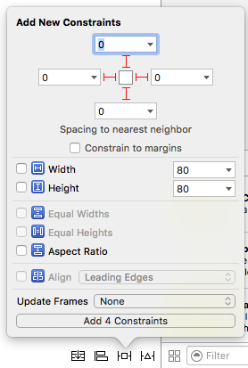
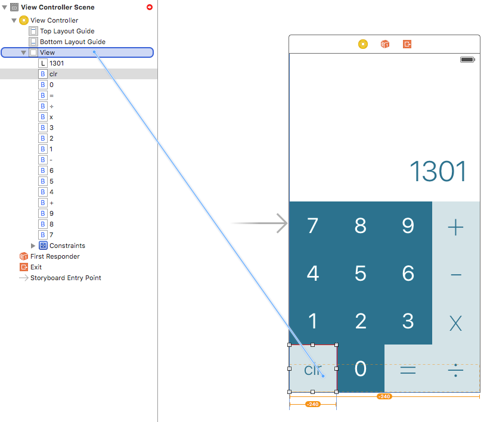
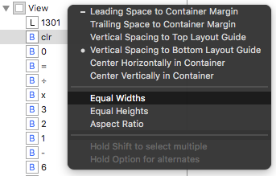
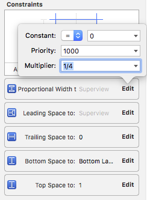
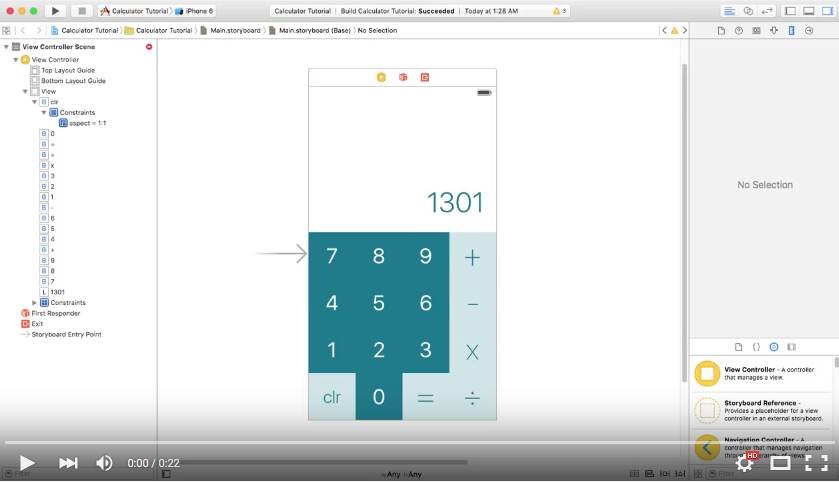
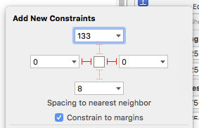
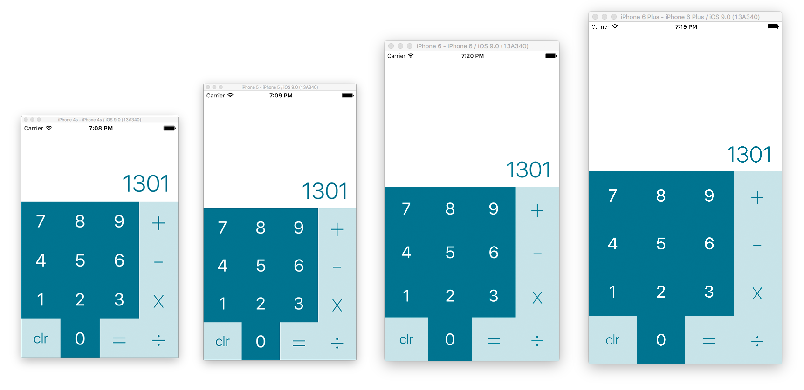

## Part 4: Setting up your Constraints

In Part 3, we designed the layout for our calculator. All of the buttons and labels exist on the canvas, but in absolute positions. This works fine and well if we use the app on the iPhone 5 simulator, because that device had the same screen size (4 inches) as the canvas that we're designing on. **What happens if we run the app on an iPhone 6 or 6 Plus?**

  

The interface doesn't grow to fill the screen. It actually stays the exact same pixel size on the screen, adding empty space to make up the difference. This is where Layout Constraints come in handy. **Constraints allow layouts to be represented as a set of relationships instead of pixel values**.

### Constraints must to be Unambiguous

The goal is constraints is to Unambiguously represent the four following parts of an object's frame:

1. **X position**
2. **Y position** (X and Y positions are called the *Origin*)
3. **Width**
4. **Height** (Width and Height are called the *Size*)

All of these can be expressed in terms of relationships. Let's define these relationships for one of the buttons on screen.

  

The frame of the **clr** button can be expressed as the following:

1. **X position**: 0 pixels from the left edge of the screen
2. **Y position**: 0 pixels from the bottom edge of the screen
3. **Width**: 1/4th the width of the main view
4. **Height**: Equal to its own width

These four relationships **unambiguously** tell us the origin and size of the button. Each of them can be quantified as a Layout Constrains on the button itself.

### Adding Position Constraints

  

At the bottom right of the canvas, there are four buttons that have been left untouched so far. These buttons have to do with constraints. ***Surprise.*** The third button, lovingly referred to as the [*Tie Fighter*](http://darkimothep.deviantart.com/art/TIE-FIGHTER-front-408839013), is the simplest way to add constraints to the selected object.

Select the **clr** button and then click the tie fighter. It should pop open and reveal a treasure-trove of useful tools.

  

The top half of that popup is for setting Position constraints. The text boxes control the Top, Bottom, Leading, and Trailing constraints. You confirm the new constraint by clicking the red line.

#### "Constrain to margins"

The one catch to position constraints is that they either constrain to the **margins** of the screen (the padding around the edge that Xcode's auto-guides are so insistent on), or the **edge** of the screen itself. By default, this is set to *Constrain to margins* (the blue checkbox below the position constraints).

### Setting your Position Constraints

Step one to setting any constraints is to select the object in question (we're starting with the **clr** button). Then, click the Tie Fighter to bring up your constraint options. Uncheck *Constrain to margins*, and then set all of the position constraints to 0. It should look like this:

  

If you did it right and are attentive, you should notice a dotted orange box inside the clr button.

  

This is the frame (size + origin) of the button once the constraints are applied. Notice how the origin is in the right place, but the size is still all wrong. That brings us to...

### Setting your Size Constraints

Our size relationships are a bit more complex, because they're relative and proportional.

- **Width**: 1/4th the width of the main view

To set up this relationship as a constraint, we have to do it a bit backwards. First, we have to set the button to be *equal width* to the main view.

You can set relationships between two specific objects by holding the `control` button and dragging to form a connection. Connect the **clr** button to the main View (which can most easily be found via the View Hierarchy on the left).

  

In the popup that follows, select **Equal Widths** and press `enter`.

  

Now we have the problem that the button thinks it's supposed to be four times wider than we want it to be. This is another job for the Size Inspector (the ruler tab). Now that we've added constraints, they exist are references in that tab. If you have the clr button selected, you should see all five constraints that we've added so far. You can click the `edit` button to make changes. There are four fields:

- **Constant**: Offsets any relationship by a set number of points. (Example, 100 pixels taller than some other view)
- **Priority**: Establishes which constraints get broken first if conflicts arise.
- **Multiplier**: Multiplies a relationship by some proportion. (Example, 2 times taller than some other view)
- **Relationship Type**: Can be =, ≥, or ≤. This comes in handy when making more complex and adaptive constraints.

We're trying to make this button 1/4th the width of the main view, so set the Multiplier to `1/4`.

  

3 constraints down, 1 to go.

- **Height**: Equal to its own width

For this, we want to set the **[Aspect Ratio](https://en.wikipedia.org/wiki/Aspect_ratio_(image))** of the button to 1:1. This is done pretty simply in the Tie Fighter popup.

  

Now, for the very first time, the **clr** button has complete constraints. The layout engine knows **unambiguously** the desired origin and frame, all completely relative to other objects on screen.

### ...but we have 15 other buttons to deal with

Lucky for all of us, the other buttons use the same constraint pattern. We just have to set the same constraints for all of the other buttons. You have two options:

1. **Do all of those steps for all of the buttons.** It's a bit tedious, but it would work fairly well.
2. If you select multiple buttons at once using the ⌘ button, then you can **simultaneously apply constraints to all of them at once**. This is more complicated to pull off, but I demonstrate it in this video. (It's very important that you select the buttons starting with the **clr** button).

[
  
](http://www.youtube.com/watch?v=KHyFUpohY90)

**([Video](http://www.youtube.com/watch?v=KHyFUpohY90)^)**

Both should work just as well, assuming you were ***pixel perfect*** when setting up your layout in Part 3. *If you have problems, double check that everything is exactly where it should be.*

### Don't forget about the label

That label at the top may be all alone, but it needs constrains too. Using the Tie Fighter, add constraints to the left, right (It already has bottom constraints, because the 7, 8, 9, and + buttons have *top* constraints that reference it). Leave *Constrain to margins* checked so there's some padding between the text and the edge of the screen. It should look like this:

  

Now we have the right constrained frame (the dotted orange line), but the view itself isn't in the right place:

  

We need to update the frame of the view to match what the layout engine expects it to be. You could do it by hand, but that sounds like a drag. Instead, Xcode comes to the rescue with a keystroke. Press **⌘⌥=** (Command + Option + Equals) on the keyboard while the label is selected. It should snap right into place.

  

### Reaping the fruits of your labor

Now you have an interface that is fully laid out, designed, **and** constrained into place. Congratulations, this is a big deal! It's only easier from here.

Now, take a look at your app in different Simulators. It should *just work*.

  

If it all works, good job!!!

If it didn't -- welcome to the life of a Software Engineer. Sometimes stuff just doesn't work the way you expect. Take a look at your constraints again (in the Ruler tab) and make sure they're all correct. You can delete a constraint by clicking on it and then pressing backspace.

### Recap
Constraints are about unambiguously defining relationships between objects on screen. You can set positional constraints relative to objects nearby with the Tie Fighter and set up other dynamic relationships using control-drag.

### Next Time
We will learn how to connect objects in the Storyboard to variable and functions in the code. I highly recommend looking into the bonus section as that explains some really important notes about IBOutlets.

#### [Part 5: Connecting Storyboard to Code](../P5/part5.md)
