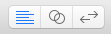
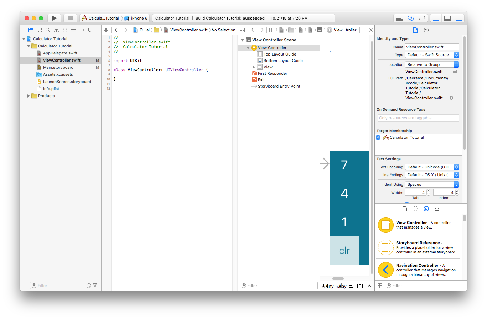
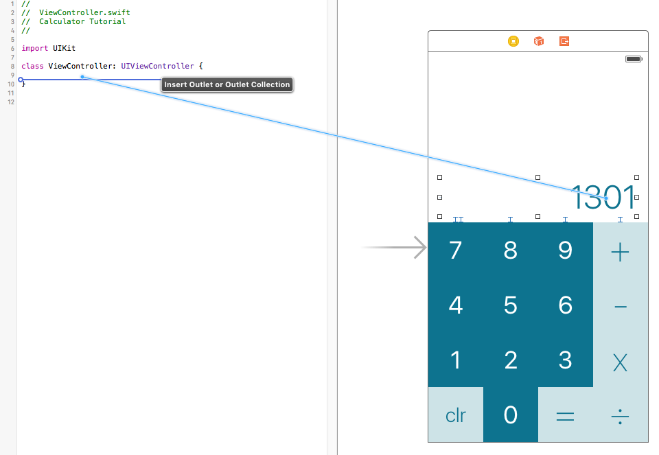
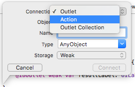

##Part 5: Connecting Storyboard to Code

In the past three parts, we laboriously created the interface for our calculator. It's been layed out, designed, *and* constrained to work on all screen sizes.
But for all this work, it doesn't actually do anything yet.

The rest of this tutorial assumes you know how to program but doesn't actually require any experience. I just won't be explaining the nitty gritty details. There are great resources out there for learning Swift if you need a crash course or a refresher.

###ViewController.swift

In our storyboard, we have a View Controller. Every View Controller should also have a corresponding *.swift* file. In this case, we have the default **ViewController.swift**. Open that file in the file viewer in the left-most pane of the window.

  

**To actually write code that interacts with out interface**, we have to connect items on screen to counterparts in code. Even before that, we have to make it so we can see both the storyboard and the code at the same time.

###Viewing Storyboard and Code at once

Xcode has our back yet again. It makes it really simple to split-screen two files at once.

  

These three buttons sit at the top right of the window. The center button is called **Counterparts**, and it lets you set up Xcode to show two different panes of content at the same time. Click that button.

After clicking the Counterparts button, the item that showed up in the new content pane is almost certainly not the Storyboard file. We'll have to open that ourselves. *Unfortunately* for us, the set up for opening things in this side pane isn't quite as intuitive as it could be.

Click the word Counterparts (or whatever the left-most item is):

  

Mouse over to **Manual**, and then navigate all the way to **Main.storyboard (base)**. It should go like this:

  

  

 

Now you probably see something entirely unhelpful like this:

  

Another caveat about Xcode is that it's more designed for a 27" iMac than a 13" Mac Book Pro. We're gonna have to close some of these sidebars so we can actually see our content. Again, Xcode has buttons to do exactly what we need.

  

Right next to the Counterparts button, there's another set of buttons that control the left and right sidebars. Close any number of them until you have enough space to work comfortably. (You can also close the View Hierarchy with a similar looking button at the bottom-right corner of the storyboard canvas.)

  

This is the setup I tend to prefer, with the File Browser (left sidebar) and the Storyboard's View Hierarchy closed. The Inspector is something that gets used fairly often so it's a good idea to have it open.

###Connecting Storyboard objects as varaibles

To access an object on the storyboard as a variable in the ViewController class, we need to connect it as an IBOutlet. Just like we set up those relative constraints, we can do a control-drag to forge a relationship. Except this time, we're establishing a connection between Storyboard and Code.

Control-drag from the `UILabel` above the buttons into the ViewController class (in-between the brackets.

  

In the popup, name the variable `resultLabel` and then press **Connect**. Now you should have a reference to the label.

  

Don't worry about what everything on that line means. The only parts that really matter for us is the name (`resultLabel`) and the type (`UILabel`). For a detailed explination of the key words and what that exclamation mark is doing, read [Part 5 Bonus: Explaining @IBOutlet "junk"](bonus.md).

Funny enough, this `resultLabel` is the only IBOutlet we need to make for now.

##Connecting UI actions to functions

We can connect functions just like we control-drag to connect variables. This time, though, we have to change the connection from an Outlet to an **Action**.

  

You'll also want to change the type from `AnyObject` to `UIButton` using the dropdown.

  

Name the function `addButtonPressed` and then press *Connect*.

Do the same for `subtractButtonPressed`, `multiplyButtonPressed`, `divideButtonPressed`, `equalsButtonPressed`, and `clearButtonPressed`. Now your View Controller should look like this:

  

###Adding connections to the number buttons
It would be pretty tragic if we had to make a unique function for all of these number buttons. `zeroButtonPressed`, `oneButtonPressed`, `twoButtonPressed`.... yikes.

We can actually connect **multiple** IBActions to the **same function**.

From any of the number buttons, control-drag and create the function `numberButtonPressed`. It's really important that you set the type to `UIButton` instead of `AnyObject` for this one. Then, you can control-drag and link all of the other nine buttons to that *one* function. That should look like this:

  

Do that for all of the number buttons and you should be good to go!

Now we have all of our code connections established, and we're ready to make this calculator actually calculate something.

###Recap
You can connect Storyboard objects to code (both variables and functions) by using a control-drag across split-screened windows.

###Next Time
We set up the protocol that will be handling the calculator's calculations.

####[Part 6: Preparing your Calculator Delegate](P6/part6.md)

