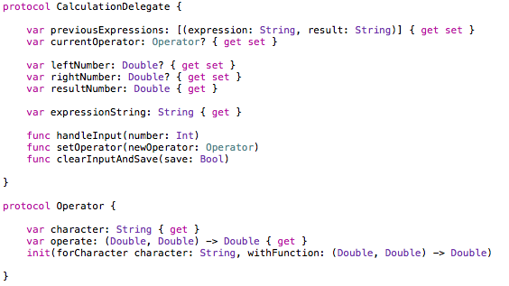

##Part 6: Preparing your Calculation Delegate

Two files that have just been hanging out in your Project file so far are the `CalculationDelegate.swift` and the `DefaultCalculations.swift`. What's the deal with these?

###CalculationDelegate.swift

<p align="center">  </p>

CalculationDelegate is a protocol that contains all of the necessary *function headers* for the logic to our calculator. Functions like `handleInput` and `setOperator` don't actually do anything yet, but it's a blueprint of how a Calculation Delegate should behave.

####So what is a delegate?

A delegate is a common concept throughout UIKit (the UI framework that things like `UIButton` and `UIViewController` are named for). They're basically just a class that another class *delegates* responsibility to. 

Another delegate we already have is the `AppDelegate.swift`, which is a `UIApplicationDelegate`. The `UIApplication` tells the delegate things like `applicationDidEnterForeground`, prompting the delegate to perform some action. We'll be doing the same thing here. Our ViewController will recieve button events and then tell our delegate things like `setOperator` and `handleInput`. 

###DefaultCalculations.swift

`CalculationDelegate` is only a protocol, so it needs to be implemented with actual logic. This tutorial doesn't assume any experience with programming in Swift, or programming in general, so that implementation is taken care of in `DefaultCalculations`. It contains the ~100 lines of source code necessary to get functional calculator logic.

**If you're up to the challenege**, you can implement `CalculationDelegate` in your own class and program that logic on your own. It might be a good idea to finish the next few sections of the tutorial first, just so you can get a good picture of how the delegate is being called. Then you can go crazy and have a good time.

###Adding a CalculationDelegate to our ViewController

Whether you're using the DefaultCalculations or your own custom implementation, we need to add it to our ViewController as an instance variable. Add this line above the @IBOutlet for your `resultLabel`:

```swift
let calculations: CalculationDelegate = DefaultCalculations()
```

Now you're ready to harnass the power of the CalculationDelegate throughout the ViewController.

###Recap
Delegates allow classes to pass on information, allowing the delegate to perform some behavior.

###Next Time
We will use the CalculationProtocol to add actual behavior to our 16 buttons (the fun part).

####[Part 7: Implementing your Buttons](P7/part7.md)