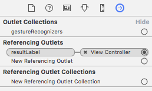

##Part 8: Testing and Debugging your Calculator

In the last few parts, you set up the code to make your calculator actually do stuff. Congrats, because that was the hard part. Now you're gonna want to make sure what you did actually works.

Open up the simulator and play around (the best way to test an app after all). Either one of two things will happen:

###1. Something doesn't work

####The code doesn't build, or is giving errors
Double check the code you typed is correct. A missing question mark is enough to break an entire project.

####A button isn't working
Revisit the storyboard file. Take a look at the Connections Inspector (arrow in a circle). Everything should have atleast one connection. This is what they look like:

  

Button Actions look the same, but they should be connected to `Touch Up Inside`, which is a *Sent Event*

####A button isn't behaving as expected
Again, double check your code. If you're using the Default CalculationDelegate, it's been tested pretty thoroughly and there shouldn't have any problems. If you implemented your own delegate, you're on your own. But you can do it!!'

###2. Everything works fine

You're all done. You've made a working storyboard app, which is no small feat. You should be proud!!

###Recap
You tested your calculator, and fixed any problems that popped up. Now you have a working storyboard app for the very first time!

###Next Time
You aren't done yet though! We'll shake up your world and fill in that mysterious empty space at the top of the screen with a UITableView. 

#### [Part 9: Preparing your UITableView](P9/part9.md)