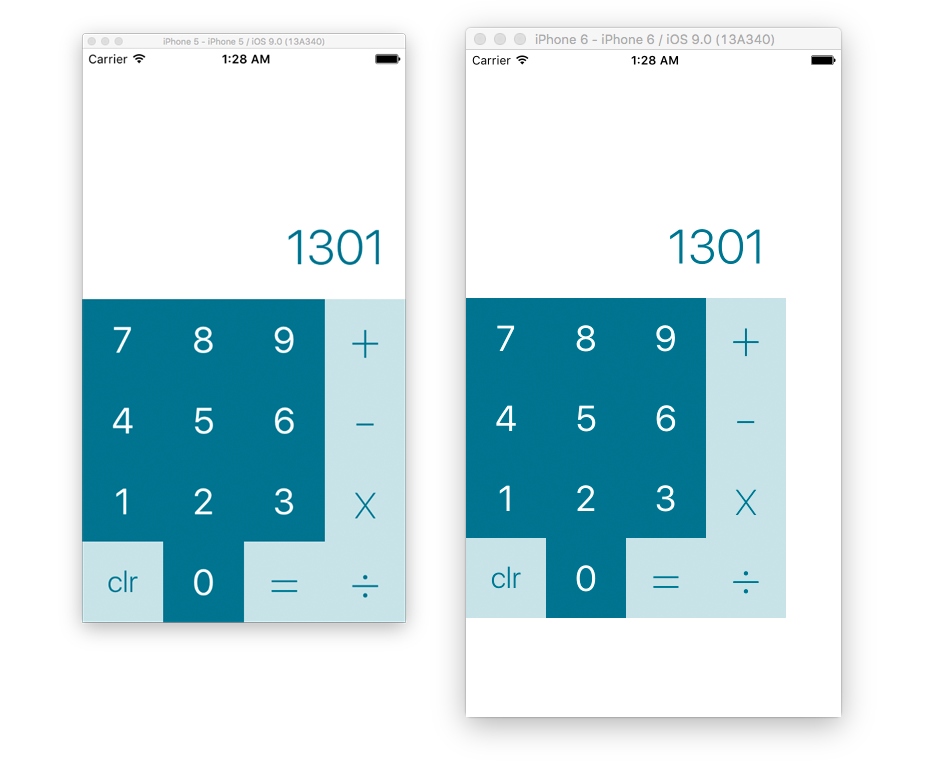

##Part 4: Setting up your Constraints

In Part 3, we designed the layout for our calculator. All of the buttons and labels exist on the canvas, but in absolute positions. This works fine and well if we use the app on the iPhone 5 simulator, because that device had the same screen size (4 inches) as the canvas that we're designing on. **What happens if we run the app on an iPhone 6 or 6 Plus?**

  

The interface doesn't grow to fill the screen. It actually stays the exact same pixel size on the screen, adding empty space to make up the difference. This is where Layout Constraints come in handy. **Constraints allow layouts to be represented as a set of relationships instead of pixel values**.

###Constraints must to be Unambiguous

The goal is constraits is to Unambiguously represent the four following parts of an object's frame:

1. **X position**
2. **Y position** (X and Y positions are called the *Origin*)
3. **Width**
4. **Height** (Width and Height are called the *Size*)

All of these can be expressed in terms of relationships. Let's define these relationships for one of the buttons on screen.

  

The frame of the **clr** button can be expressed as the following:

1. **X position**: 0 pixels from the left edge of the screen
2. **Y position**: 0 pixels from the bottom edge of the screen
3. **Width**: 1/4th the width of the main view
4. **Height**: Equal to its own width

These four relationships **unambiguously** tell us the origin and size of the button. Each of them can be quantified as a Layout Constrains on the button itself.

###Adding your first Constraints

  

At the bottom right of the canvas, there are four buttons that have been left untouched so far. These buttons have to do with constraints. ***Surprise.*** The third button, lovingly referred to as the [*Tie Fighter*](http://darkimothep.deviantart.com/art/TIE-FIGHTER-front-408839013), is the simplest way to add constraints to the selected object.

Select the **clr** button and then click the tie fighter. It should pop open and reveal a treasure-trove of useful tools.

  

TODO:

1. talk about how to add leading/trailing/top/bottom constraints
2. talk about how to add constraints with multipliers/ratios
3. add constraints to all the buttons